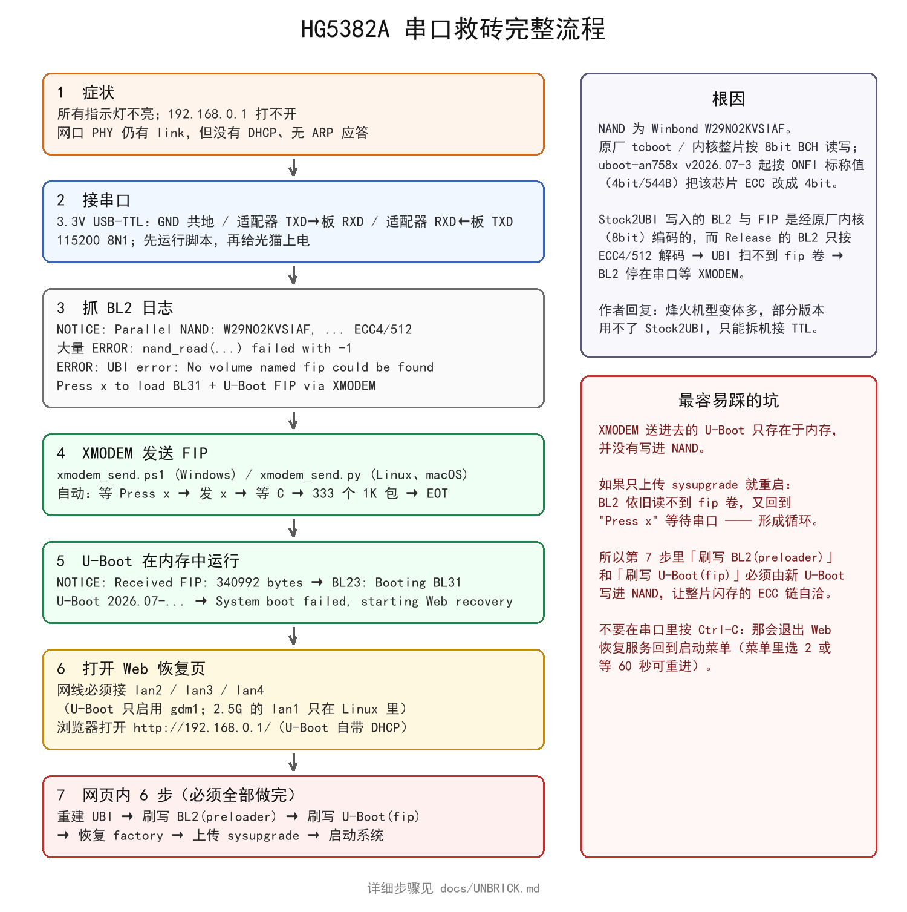
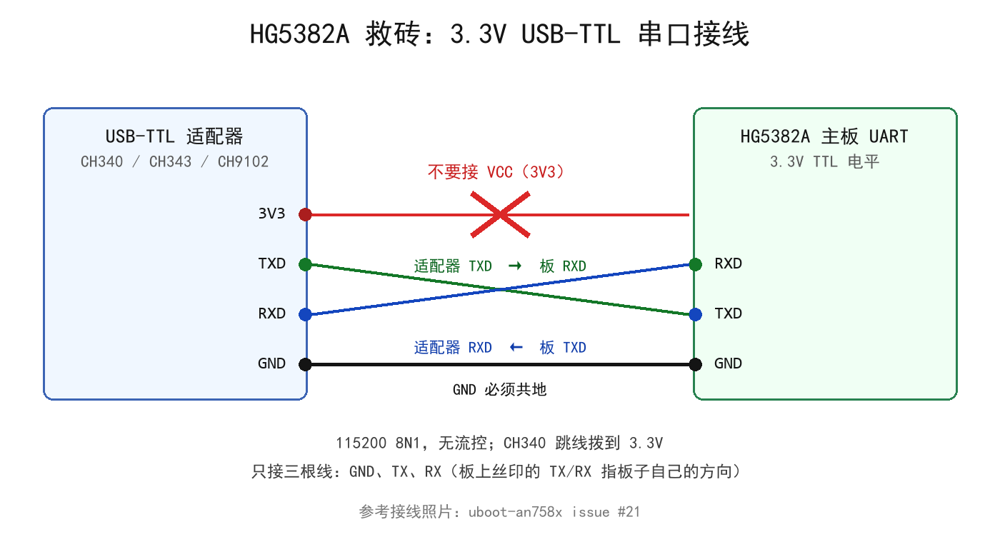

# PonWrt 救砖指南：串口 + XMODEM 恢复 U-Boot

本文记录 **FiberHome HG5382A（Airoha AN7581）在用 Stock2UBI 刷入恢复引导后“全灯不亮、
192.168.0.1 打不开”** 这一故障的完整原因与恢复流程，并在 `docs/unbrick/` 下提供可直接运行的
脚本。适用于所有 AN7581/AN7583 机型，只是串口位置与镜像文件名不同。

> **TL;DR**
> 这类“假砖”通常不是写坏了，而是 **NAND ECC 位宽不一致**：原厂以 8bit BCH 写入的 BL2/FIP
> 被只按 `ECC4/512` 解码的 BL2 读不出来，于是 BL2 停在串口等待 FIP。
> 接 3.3V TTL（115200 8N1）→ 用 `docs/unbrick/xmodem_send.ps1`（或 `.py`）把
> `*-bl31-u-boot.fip` 通过 XMODEM 送进内存 → 进 U-Boot Web 恢复页 →
> **重建 UBI → 刷写 BL2(preloader) → 刷写 U-Boot(fip) → 恢复 factory → 上传 sysupgrade → 启动系统**。
> 第 3、4 步必须做完，否则重启后还会回到 BL2 的 `Press x` 提示（XMODEM 启动不落盘）。



---

## 1. 先判断：是不是本文这种情况

| 现象 | 说明 |
| --- | --- |
| 上电后**所有指示灯都不亮** | 电源灯是 GPIO13，由 U-Boot/Linux 驱动；BL2 不点灯，所以“无灯”只说明 U-Boot 没起来 |
| 电脑网口**PHY 仍有 link**（如 1 Gbps） | 板子有电、PHY 在工作，网络层什么都没有 |
| 网卡拿不到 DHCP、`arp` 里没有设备 | 没有任何引导在跑网络栈 |
| `192.168.0.1` / 原厂 `192.168.1.1` 都不通 | 既不是 U-Boot Web 恢复、也不是原厂系统 |
| 按住 Reset 上电仍无恢复页 | 同上 |

只要串口能看到下面这几行，就属于本文覆盖的情况（见第 4 节日志样例）：

```text
NOTICE:  Parallel NAND: W29N02KVSIAF, ID ef:da:069510, page 2048, erase 131072, ECC4/512
ERROR:   UBI error: No volume named fip could be found
ERROR:   BL2: Failed to load image id 3 (-2)
ERROR:   Stored BL31 + U-Boot FIP failed (-2)
Press x to load BL31 + U-Boot FIP via XMODEM
```

## 2. 根因：原厂 8bit BCH 与 BL2 的 4bit ECC 不一致

- 这批 HG5382A 的 NAND 是 **Winbond W29N02KVSIAF**；原厂 tcboot / BL2 与内核**整片按 8bit BCH** 读写；
- [uboot-an758x](https://github.com/pbs05/uboot-an758x) 从 **v2026.07-3** 起按 Winbond AN0000025 的 ONFI
  标称值（4bit/544B）把该芯片的 ECC 需求改成 4bit（[4b7a0b6e](https://github.com/pbs05/uboot-an758x/commit/4b7a0b6e0fbcb5829aaf16f34afb0fb1494b1af8)、
  [ef8870ad](https://github.com/pbs05/uboot-an758x/commit/ef8870ad51edc004d4f32c314404b9c714c536ec)）；
- **Stock2UBI 写的 BL2 与 FIP 是调原厂内核写的**，页数据全部是 8bit 编码；而 Release 的 BL2 只按
  `ECC4/512` 解码，UBI 扫描时大量块 ECC 不可纠正 → 找不到 `fip` 卷 → BL2 转到串口等 XMODEM。

因此：

- **工具提示 “readback verified” 是正常的**——它用原厂内核（8bit）回读校验，当然一致；问题在读侧；
- 上游作者在 [issue #21](https://github.com/pbs05/uboot-an758x/issues/21) 中的说明是：烽火机型变体较多，
  部分版本用不了 Stock2UBI，只能拆机接 TTL；
- 恢复后整片闪存是 **4bit 链**，所以第 3、4 步（重建 UBI + 重刷 BL2 + 重刷 fip）缺一不可。

## 3. 准备

### 3.1 硬件

- **3.3V USB-TTL 适配器**（CH340 / CH343 / CH9102 / CP2102 均可；CH343 在大包量下更稳）；
- 三根杜邦线或测试钩；CH340 模块若有 5V/3.3V 跳线，**拨到 3.3V**；
- 参数固定：**115200 8N1、无流控**。



要点：

- **只接三根线**：`GND` 共地、适配器 `TXD` → 板 `RXD`、适配器 `RXD` ← 板 `TXD`（交叉）；
- **绝对不要接 VCC/3V3**：板子自己供电，接错可能损伤 UART；
- 板上丝印的 TX/RX 指板子自己的方向，所以按上面的交叉关系接；
- 接线照片见 [issue #21 的配图](https://github.com/user-attachments/assets/91c2d001-1546-47a5-bca3-aca3bece29de)。

### 3.2 文件（务必校验）

从 [uboot-an758x Releases](https://github.com/pbs05/uboot-an758x/releases)（用 **v2026.07-4 或更新**）取：

| 文件 | 大小 | sha256 |
| --- | --- | --- |
| `an7581-fiberhome-hg5382a-bl31-u-boot.fip` | 340992 | `b027ba7b18330dc8445b4b96603cab4d7134f3ff25861c4f293e0a2b58f4a8fe` |
| `an7581-fiberhome-hg5382a-preloader.bin` | 115712 | `16f22ef6e8278d86306c78f282cb4693f094a24610896e0fd0c59086f8b23575` |
| `an7581-fiberhome-hg5382a-firstblock.bin` | 131072 | `680ea7b86a764d62a40b7e46b918578c83209dc333d89eb4055d73fcac66e2c8` |

（**不要和 hg5585f-ct 的文件混用**：它们大小完全一样，只有哈希不同。）

### 3.3 脚本

| 文件 | 平台 | 用途 |
| --- | --- | --- |
| [`unbrick/serial_log.ps1`](unbrick/serial_log.ps1) | Windows PowerShell 5.1 / 7+ | 纯串口抓日志，含“可打印字符占比”心跳，用来先确认接线 |
| [`unbrick/xmodem_send.ps1`](unbrick/xmodem_send.ps1) | Windows PowerShell 5.1 / 7+ | 等 `Press x` → 发 `x` → 等 `C` → 发 333 个 1K 包 → EOT |
| [`unbrick/xmodem_send.py`](unbrick/xmodem_send.py) | Linux / macOS（Python 3，无第三方依赖） | 同上，等价实现 |

两个 PowerShell 脚本都做了两件关键的事：**无论如何（含 Ctrl+C）都会释放 COM 口**，
以及**只把裸字节 `C` 当作 XMODEM 握手**（日志里的 `NOTICE:`、`Current in BL21` 也含字母 C，
早期版本会因此误判）。

## 4. 完整流程

### 4.1 先运行脚本，再给光猫上电

Windows（`COM19` 换成你的实际端口，可用 `.\serial_log.ps1 -ListPorts` 查）：

```powershell
& .\docs\unbrick\serial_log.ps1 -Port COM19 -Seconds 40
```

Linux/macOS：

```sh
python3 docs/unbrick/xmodem_send.py --self-test        # 可选自检
picocom -b 115200 /dev/ttyUSB0                         # 或先用任何终端确认日志
```

**顺序很重要**：脚本必须先运行、再上电，因为 BL2 的 `Press x` 等待有超时，错过就只能再断电重来。

### 4.2 确认 BL2 日志

上电后会看到（已折叠无关行，完整日志在 `xmodem_log*.txt`）：

```text
NOTICE:  BL21/BL22/BL23: v2.10.0 (release):v2026.07-4
AN7581DRAMC V1.0 ... DRAM FLOW DONE!!!
NOTICE:  Parallel NAND: W29N02KVSIAF, ID ef:da:069510, page 2048, erase 131072, ECC4/512
NOTICE:  FIP source: UBI volume
NOTICE:  UBI: scanning [0x20000 - 0x10000000] ...
ERROR:   nand_read(133120) failed with -1. 2164264183 bytes read        <- 大量重复，正常
NOTICE:  UBI: scanning is finished
ERROR:   UBI error: No volume named fip could be found
ERROR:   Stored BL31 + U-Boot FIP failed (-2)
Press x to load BL31 + U-Boot FIP via XMODEM
```

整片 NAND 扫描通常需要 **1.5~2 分钟**，期间刷屏属正常。
`serial_log.ps1` 的心跳行 `printable=` 若长期低于 10%，说明拿到的是**噪声**（板子没上电、
TX/RX 接反或线松），先解决接线再看日志。

### 4.3 用 XMODEM 把 FIP 送进内存

Windows：

```powershell
# 把 fip 放在脚本同目录（或 -File 指定路径），然后：
& .\docs\unbrick\xmodem_send.ps1 -Port COM19

# 如果板子已经停在 Press x 提示上（错过了横幅），直接发 x：
& .\docs\unbrick\xmodem_send.ps1 -Port COM19 -SendXAfter 3
```

Linux / macOS：

```sh
python3 docs/unbrick/xmodem_send.py -d /dev/ttyUSB0
# 或经典组合（issue 作者用的方式）
#   picocom -b 115200 --send-cmd "sx -k" /dev/ttyUSB0
```

成功时的输出（耗时实测）：

```text
waiting for the BL2 XMODEM session; polling 'x' every 5s
'Press x' banner seen
XMODEM handshake detected
starting transfer attempt 1/4
>> 333/333 packets (100%)
all 333 packets ACKed in 75s -> sending EOT
EOT -> ACK
```

板上随后的日志：

```text
NOTICE:  Received FIP: 340992 bytes
NOTICE:  BL23: Booting BL31
NOTICE:  BL31: v2.10.0  (release):v2026.07-4
U-Boot 2026.07-gd5b173d17470 (Sep 23 2026 - 13:58:24 +0000)
...
System boot failed, starting Web recovery
DHCP pool: 192.168.0.100 - 192.168.0.199
HTTP management: http://192.168.0.1/  (DHCP enabled)
Press Ctrl-C to return to the serial console.
```

> 此时 **U-Boot 只存在于内存**，任何重启都会回到 4.2 的 `Press x`。

### 4.4 打开 U-Boot Web 恢复页

- 网线插光猫的 **`lan2` / `lan3` / `lan4`**：
  U-Boot 的板级设备树只启用了 `&gdm1`（内部交换机 → 这三个千兆口），
  **2.5G 的 `lan1`（`gdm4` + GPY211）只在 Linux 里启用**，在 U-Boot 阶段插 lan1 不会有任何应答；
- PC 侧可以用 **DHCP**（U-Boot 自带 DHCP 服务，地址池 `192.168.0.100-199`），
  或手工设静态 `192.168.0.x/24`；
- 浏览器打开 `http://192.168.0.1/`。

### 4.5 网页里必须完成的 6 步

| 顺序 | 操作 | 说明 |
| --- | --- | --- |
| 1 | **重建 UBI** | 清掉原厂 8bit 编码的 UBI 布局 |
| 2 | **刷写 BL2（preloader）** | ⚠️ 关键：只在网页里写过，首块才是 4bit 链写入 |
| 3 | **刷写 U-Boot（fip）** | 把 fip 写进 NAND 的 `fip` 卷，重启后 BL2 才读得到 |
| 4 | **恢复板级数据卷** | 第 5 节的 factory 镜像写入 `factory` 卷 |
| 5 | **上传 sysupgrade** | 本仓库 Releases 的 `*-fiberhome_hg5382a-sysupgrade.itb` |
| 6 | **启动系统** | 之后进 LuCI `http://192.168.1.1/` |

只做「上传 sysupgrade + 启动系统」不够：BL2 依旧读不到 `fip` 卷，重启后又回到 `Press x`。
判断是否真的写进去了：下一次冷启动时串口应当**不再出现** `No volume named fip could be found`。

### 4.6 factory 数据与 PON 配置

与正常刷机完全一致，见 [FLASHING.md](FLASHING.md) 第 4、5 节：
用 [fiberhome-factory](https://github.com/pbs05/fiberhome-factory) 把原厂 `factory` 备份转成 1 MiB 布局，
写入 `factory` 卷，再按原厂制式配置 `/etc/config/pon`。

## 5. 常见问题

| 现象 | 原因与处理 |
| --- | --- |
| `OPEN FAILED ... Access to the path 'COM19' is denied` | 端口被占用：关掉串口助手 / Tera Term / 上一个脚本窗口。仓库里的脚本已保证 Ctrl+C 也会释放端口 |
| 串口只有乱码，心跳 `printable` < 10% | 收到的是噪声：板子没通电、TX/RX 接反、没共地，或适配器跳线在 5V |
| `xmodem_send` 一直等不到 `Press x` | 上电顺序错了（必须先跑脚本再上电），或板子根本没在 BL2 阶段（看日志） |
| 传输卡在某个包 | 脚本默认每包等 10 秒、重试 5 次后自动重发 `x` 重新握手并从第 1 包重来；若反复卡同一位置，换 CH343/CH9102 适配器，或降低线长 |
| 传完 U-Boot 后重启又回到 `Press x` | 没有在网页里写 BL2 + fip（XMODEM 只在内存）。按 4.5 重做 |
| `192.168.0.1` 打不开，但串口已到 `HTTP management` | 网线插在 lan1（2.5G），或 PC 没有 `192.168.0.x` 地址，或 U-Boot 的 httpd 已被 Ctrl+C 退出 |
| 在串口里误按 Ctrl+C 后退出了恢复页 | 会回到启动菜单：菜单里选 `2. Web recovery`，或等 60 秒自动重进；也可在控制台执行 `httpd dhcp` |
| 没有原厂 `factory` 备份 | PON 无法注册且难恢复；只能尝试运营商售后或同型号设备移植校准数据 |
| `preloader.bin` 还是 `firstblock.bin`？ | **两者等价**：`firstblock` 只是把 `preloader` 垫到 128 KiB 首块的 `0x800` 偏移、其余补 `0xff`。Stock2UBI 两种都支持 |

## 6. 原理补充

- **为什么必须重刷 BL2**：NAND 上首块（BL2/preloader）与 `fip` 卷必须使用同一套 ECC 参数。
  XMODEM 启动的 U-Boot 由新的 4bit 链写入 BL2/fip 后，整片闪存才自洽；只换 fip 会留下一个
  仍按 8bit 编码的首块，BL2 每次都会失败。
- **XMODEM 参数**：1024 字节载荷（STX 帧）+ CRC16/CCITT，共 `ceil(340992/1024) = 333` 包，
  115200 下约 75 秒。CRC 校验向量 `CRC16("123456789") = 0x31C3`（`--self-test` 会验证）。
- **BL2 的 `Press x` 有超时**：所以脚本用“轮询 `x`”的方式，即使错过横幅也能在提示符出现时接上。

## 7. 参考

- 上游 issue（现象、根因与内测结论）：<https://github.com/pbs05/uboot-an758x/issues/21>
- AN758x U-Boot（镜像与手动刷机说明）：<https://github.com/pbs05/uboot-an758x>
- AN758x-Stock2UBI（原厂系统内刷入工具）：<https://github.com/pbs05/an758x-stock2ubi>
- 常规刷机流程：[FLASHING.md](FLASHING.md)
