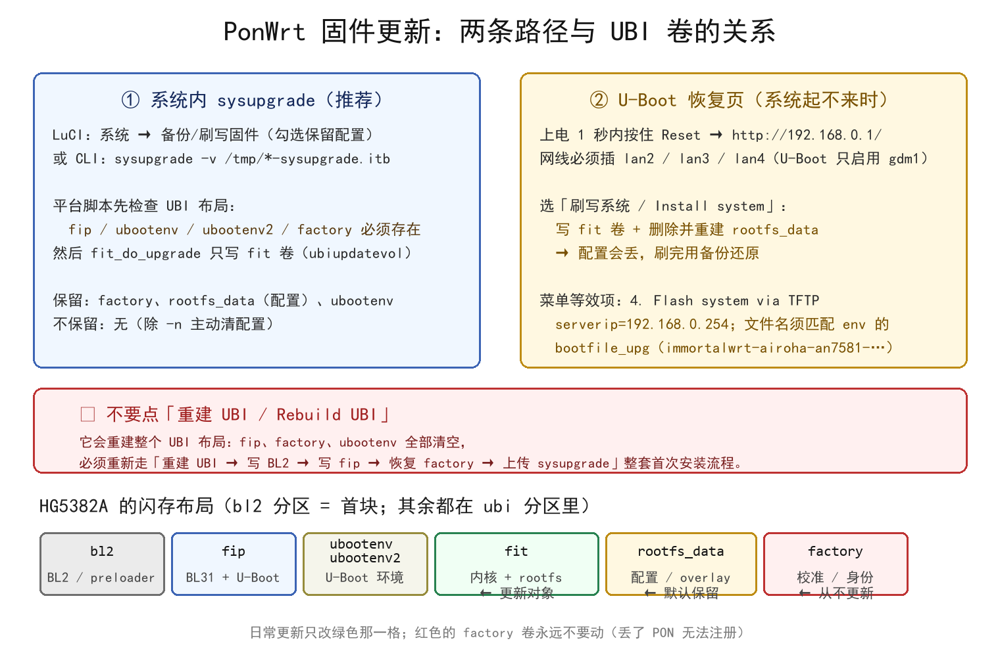

# PonWrt 固件更新指南

本文面向**已经刷好 PonWrt 的设备**，说明三种“更新”的区别与做法：

| 你要更新什么 | 走哪条路 | 配置是否保留 |
| --- | --- | --- |
| **PonWrt 系统本身**（内核 + rootfs，即日常升级） | 系统内 `sysupgrade`（LuCI 或命令行） | **保留**（除非 `-n`） |
| 系统起不来、但 U-Boot 还在 | U-Boot 恢复页 **「刷写系统」** | **不保留**（`rootfs_data` 被重建） |
| **引导**（BL2 + BL31/U-Boot FIP） | U-Boot 恢复页写 BL2 + 写 fip（必须成对） | 卷布局不变则不影响配置 |



> ⚠️ 三件事不要做：**不要**在日常升级时点 U-Boot 的「重建 UBI」；
> **不要**把 `*-initramfs-recovery.itb` 当 sysupgrade 镜像刷；
> **不要**单独更新 BL2 或单独更新 fip（两者必须同一版本、成对写入）。

---

## 1. 平台内部是怎么升级的

了解这一点，就能明白为什么日常升级既安全又保留配置。

1. 平台脚本 [`target/linux/airoha/an7581/base-files/lib/upgrade/platform.sh`](../target/linux/airoha/an7581/base-files/lib/upgrade/platform.sh)
   对 HG5382A 的升级函数是：

   ```sh
   airoha_require_ubi_layout factory && fit_do_upgrade "$1"
   ```

   - **预检**：`fip`、`ubootenv`、`ubootenv2`、`factory` 卷必须存在，且 `fip` 卷非空；
     否则直接拒绝，并提示 `repair the layout from U-Boot recovery`；
   - 该文件同时设置 `REQUIRE_IMAGE_METADATA=1`，并用 `fit_check_image` 校验镜像是带
     OpenWrt metadata 的 FIT（magic `d00dfeed`）。

2. [`package/utils/fitblk/files/fit.sh`](../package/utils/fitblk/files/fit.sh) 的 `fit_do_upgrade()`
   读取设备树 `chosen/rootdisk`（HG5382A 指向 `ubi_fit`），得到 `CI_KERNPART=fit`，
   最终走 `nand_do_upgrade`，即 **只把新 FIT 写进 UBI 的 `fit` 卷**。

3. 因此一次 sysupgrade **只改一个卷**：

```text
bl2(分区)   fip       ubootenv/ubootenv2   fit                rootfs_data        factory
BL2/首块    BL31+UB   U-Boot 环境          内核+rootfs        配置/overlay       校准/身份
 不变        不变        不变              ← 被更新 →         默认保留            永不动
```

`factory`（PON SN / MAC / 光模块校准）与 `rootfs_data`（你的配置）都不在升级范围内。

## 2. 日常升级（推荐）：系统内 sysupgrade

### 2.1 取得镜像

- **本仓库 CI**：Actions → `Build PonWrt Firmware` → `Run workflow`（可选 AN7583 等选项），
  产物在 Release / Artifacts 里，形如
  `ponwrt-airoha-an7581-fiberhome_hg5382a-squashfs-sysupgrade.itb`；
- **本地编译**：产物在 `bin/targets/airoha/an7581/`（构建配置见
  [`configs/an7581.config`](../configs/an7581.config)）。

必须使用 **`*-squashfs-sysupgrade.itb`**；`*-initramfs-recovery.itb` 只用于 U-Boot 内存启动 /
TFTP 引导，作为 sysupgrade 镜像会被 metadata 检查拒绝。

### 2.2 校验（建议）

```powershell
# Windows
(Get-FileHash .\ponwrt-airoha-an7581-fiberhome_hg5382a-squashfs-sysupgrade.itb -Algorithm SHA256).Hash.ToLower()
```

```sh
# Linux/macOS：与发布页的 sha256sums 比对
sha256sum -c sha256sums --ignore-missing
```

设备上也能算：

```sh
scp ponwrt-airoha-an7581-fiberhome_hg5382a-squashfs-sysupgrade.itb root@192.168.1.1:/tmp/
ssh root@192.168.1.1 'sha256sum /tmp/ponwrt-*-sysupgrade.itb'
```

### 2.3 LuCI

**系统 → 备份/刷写固件** → 「刷写新固件」选择镜像 → 决定是否勾选「保留配置」→ 刷写。
页面会先做镜像校验，然后写入并自动重启。

### 2.4 命令行

```sh
scp ponwrt-airoha-an7581-fiberhome_hg5382a-squashfs-sysupgrade.itb root@192.168.1.1:/tmp/
ssh root@192.168.1.1

# 只校验镜像，不刷写：
sysupgrade -T /tmp/ponwrt-airoha-an7581-fiberhome_hg5382a-squashfs-sysupgrade.itb

# 正常升级（保留配置；/tmp 是内存盘，路径要写对）：
sysupgrade -v /tmp/ponwrt-airoha-an7581-fiberhome_hg5382a-squashfs-sysupgrade.itb

# 不保留配置（配置被改乱、或换了发行分支时）：
sysupgrade -n -v /tmp/ponwrt-...-squashfs-sysupgrade.itb
```

其它常用参数（`sysupgrade -h` 可看全）：

| 参数 | 作用 |
| --- | --- |
| `-n` | 不保留配置 |
| `-c` | 尽量保留 `/etc` 下所有改动过的文件（默认只保留 `sysupgrade.conf` 列表内的） |
| `-f <backup.tar.gz>` | 刷写的同时用这份备份恢复配置 |
| `-b <file>` / `-r <file>` | 仅备份 / 仅恢复配置，**不刷机** |
| `-T` | 只校验，不刷写 |
| `-F` | 校验失败也强刷（危险，仅在明确知道原因时使用） |

升级过程会写 NAND 并重启，**中途不要断电**。

### 2.5 升级后验证

```sh
cat /etc/openwrt_release                 # 版本
ubus call system board                   # 机型 / 内核
ip -br link; ip -4 addr                  # 桥接/管理口是否符合预期
pondctl status --line line0               # PON 注册状态（配置保留时应与升级前一致）
```

## 3. 系统起不来时：U-Boot 恢复页

进入方式：上电 1 秒内按住 Reset（或在串口菜单选 `2. Web recovery`），
网线插 **`lan2`/`lan3`/`lan4`**（U-Boot 只启用内部交换机 `gdm1`；2.5G 的 `lan1` 只在 Linux 阶段可用），
浏览器打开 `http://192.168.0.1/`（U-Boot 自带 DHCP，地址池 `192.168.0.100-199`）。

### 3.1 Web 路径

选择 **「刷写系统 / Install system」**，上传 `*-squashfs-sysupgrade.itb`。

- 对应的 U-Boot 命令是 `ubi_write_production`：写 `fit` 卷，并**删除后重建 `rootfs_data`**；
- 结论：**配置会丢**。刷完进系统后用 LuCI `系统 → 备份/恢复` 上传之前的备份，或在串口/SSH 下
  `sysupgrade -r /tmp/backup.tar.gz`；
- 引导（`fip` 卷、BL2 首块）与 `factory` 卷不受影响。

### 3.2 TFTP 路径（无浏览器时）

串口菜单里选 **`4. Flash system via TFTP`**（等价 `boot_tftp_write_production`）。
两个必须匹配的环境变量（[`an7581_fiberhome_hg5382a.env`](https://github.com/pbs05/uboot-an758x/blob/main/board/airoha/an7581/an7581_fiberhome_hg5382a.env)）：

```text
serverip    = 192.168.0.254                          # 你的 TFTP 服务器必须在这个地址
bootfile_upg= immortalwrt-airoha-an7581-fiberhome_hg5382a-squashfs-sysupgrade.itb
```

本仓库的镜像名是 `ponwrt-...`，所以要么把文件改名成 `bootfile_upg` 的值，
要么先在 U-Boot 控制台里改环境变量：

```text
setenv bootfile_upg ponwrt-airoha-an7581-fiberhome_hg5382a-squashfs-sysupgrade.itb
saveenv
```

同样注意：这条路径也会重建 `rootfs_data`（配置丢失）。

### 3.3 为什么不要点「重建 UBI」

「重建 UBI / Rebuild UBI」是**首次安装**用的：它会重建整个 UBI 布局，`fip`、`ubootenv`、
`factory` 全部被清掉，之后必须完整重走一遍

```text
重建 UBI → 刷写 BL2(preloader) → 刷写 U-Boot(fip) → 恢复 factory → 上传 sysupgrade → 启动系统
```

（详见 [FLASHING.md](FLASHING.md) 第 3、4 节。）日常升级不需要它。

## 4. 引导（BL2 + fip）的更新

只有 [uboot-an758x](https://github.com/pbs05/uboot-an758x) 发布新版本、需要更新引导时才做：

1. 恢复页里写 `*-bl31-u-boot.fip`（写入 `fip` 卷）；
2. **同时**写 BL2：`*-preloader.bin` 或 `*-firstblock.bin`（两者等价，写入 NAND 首块）；
3. 二者必须**同一版本、成对写入**——只换其一会因为 NAND ECC 参数不一致导致 BL2 读不到 `fip` 卷，
   表现就是“全灯不亮、`192.168.0.1` 打不开、串口停在 `Press x`”，需要用
   [UNBRICK.md](UNBRICK.md) 恢复；
4. 若新版引导改了 UBI 布局（卷名/大小），才需要「重建 UBI」，此时**先确认手上有 `factory` 备份**。

**日常固件升级不涉及这一步**，也不会破坏 4bit ECC 链。

## 5. 备份与回滚

```sh
# 备份配置（不刷机）
sysupgrade -b /tmp/ponwrt-backup-$(date +%F).tar.gz
# 需要时恢复到设备
sysupgrade -r /tmp/ponwrt-backup-2026-10-06.tar.gz

# 顺手备份 factory 卷（PON SN / MAC / 光模块校准，丢了很难恢复）
ls /sys/class/ubi/                       # 找到名字为 factory 的卷号，例如 ubi0_3
ssh root@192.168.1.1 "head -c 1048576 /dev/ubi0_3" > factory.bin
```

回滚：保留上一版 `*-squashfs-sysupgrade.itb`，系统能起来就用 `sysupgrade` 刷回去；
起不来就走第 3 节的 U-Boot 恢复页。

## 6. 常见报错

| 报错 / 现象 | 原因与处理 |
| --- | --- |
| `Image metadata not found` / `Invalid image type` | 刷错镜像（用了 `*-initramfs-recovery.itb`，或不是本机型的 itb）；换成 `*-squashfs-sysupgrade.itb` |
| `UBI base volume fip is missing; repair the layout from U-Boot recovery.` | UBI 布局损坏（多见于误点「重建 UBI」或引导未写全）→ 去 U-Boot 恢复页修，别继续 sysupgrade |
| `The fip volume does not contain BL31/U-Boot; install the boot chain first.` | `fip` 卷是空的 → 恢复页里写一次 `bl31-u-boot.fip` |
| 写入时提示空间不足 | `fit` 卷按首次安装时的镜像大小创建；先备份配置，再从 U-Boot 恢复页重写 `fip`/重建 UBI（配置会丢） |
| 升级后配置全没了 | 走了 U-Boot 恢复页路径（会重建 `rootfs_data`），或用了 `-n` → 用备份恢复 |
| 升级后 PON 不注册 | 检查 `factory` 卷是否还在（`ls /sys/class/ubi/`、`ubinfo -a`）以及 `/etc/config/pon` 的制式与 SN/LOID |

## 7. 相关文档

- 首次刷机流程：[FLASHING.md](FLASHING.md)
- 变砖恢复（全灯不亮 / BL2 等 XMODEM）：[UNBRICK.md](UNBRICK.md)
- 桥接拨号（第 6 节）里注意：**不要把 `lan2`/`lan3`/`lan4` 全部移出 `br-lan`**，
  否则系统起不来时 U-Boot 阶段没有网口能访问 `192.168.0.1`（U-Boot 只认 `gdm1` 这三个千兆口）。
